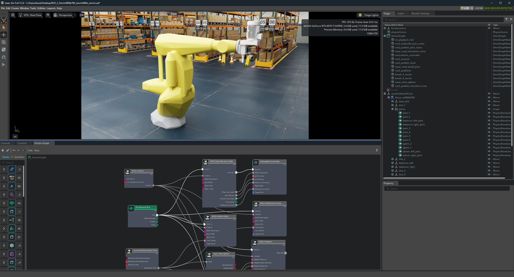
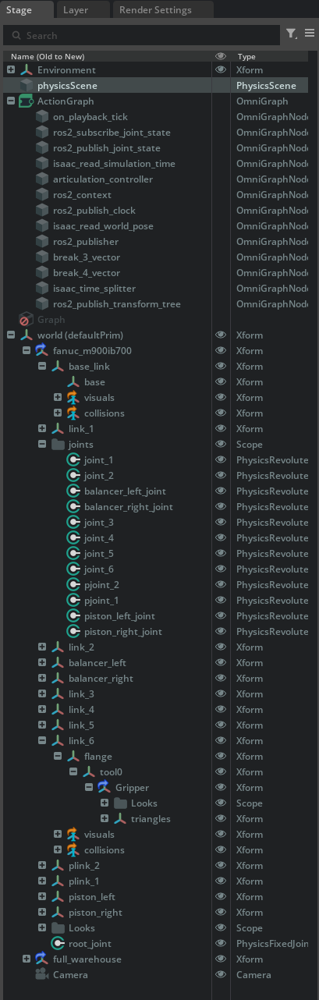
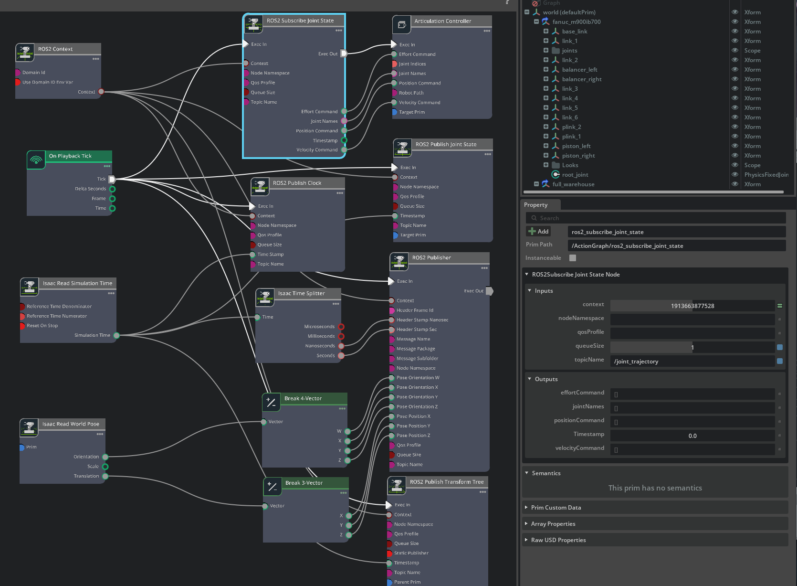
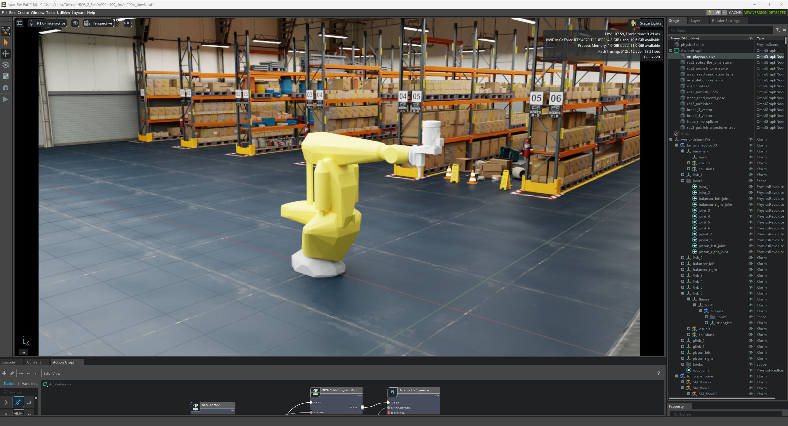
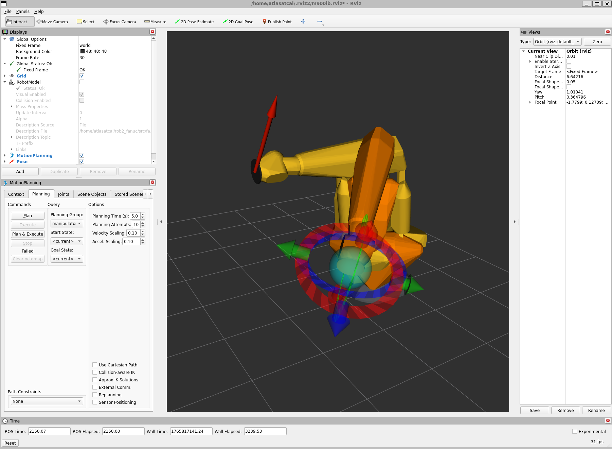
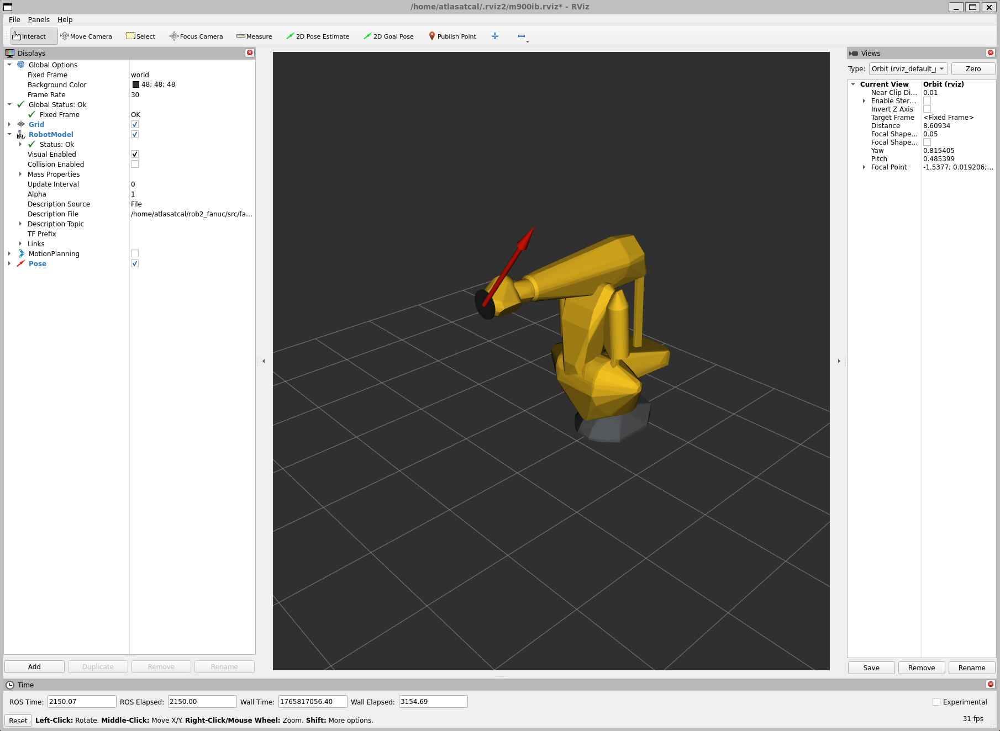
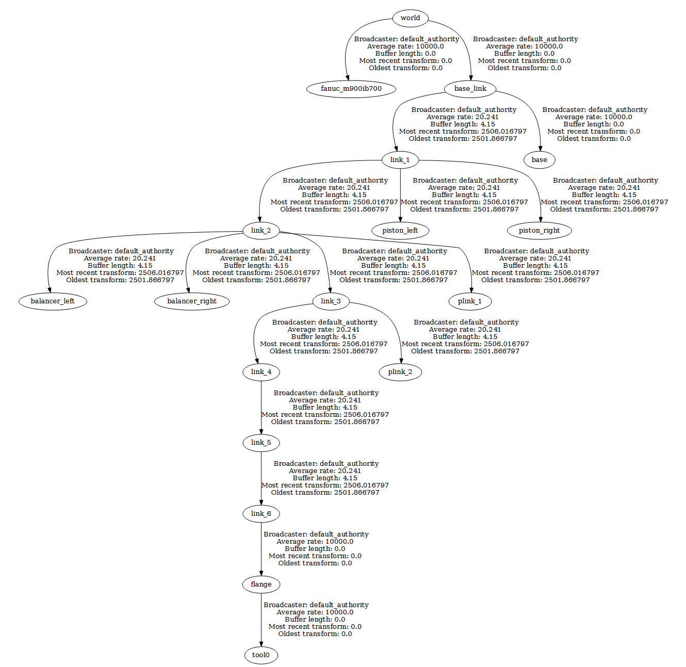

# Setup

- `Isaac Sim 5.1` natively on Windows 11 with Ros2-Bridge enabled/configured
```bash
...\isaac-sim.bat --/isaac/startup/ros_bridge_extension=isaacsim.ros2.bridge
```
- ROS 2: `Humble` running inside WSL2 (Ubuntu 22)
- WSL2 Network type set *Nat* - var. FastDDS & Domain_ID set


# Launch Node P->1

```bash
run_fanuc() {
    source ~/rob2_fanuc/install/setup.bash
    # Set of var
    export ROS_DOMAIN_ID=0
    export RMW_IMPLEMENTATION=rmw_fastrtps_cpp
    # Launch
    ros2 launch fanuc_isaac_wrapper isaac_moveit.launch.py
}
```

# Launch Node P->2.v1

## Start-up PID-SERVO v1

```bash
#servo start-up
ros2 service call /servo_node/start_servo std_srvs/srv/Trigger {}
#kill SERVO
pkill -f tcp_pid_servo

```
# Launch Node P->2.v2
## Start-up PID-SERVO v2
**!! Keep PID off until -> ROB out of Singularity**
```bash
ros2 run fanuc_isaac_wrapper tcp_pid_servo.py
```

**Bringup with PID automatically**
```bash
ros2 launch fanuc_isaac_wrapper isaac_moveit.launch.py start_pid:=true
```

**Manual Publish**
```bash
ros2 topic pub -1 /joint_commands sensor_msgs/msg/JointState "
name: ['joint_1','joint_2','joint_3','joint_4','joint_5','joint_6']
position: [0.0, 0.3, 0.0, 0.0, 0.0, 0.0]
"
```
**.OR.**

```bash
~/joint_command_stream.py
```

**.OR.**

```bash
~/joint_jog_test.py

~/joint_jog_test.py --joint joint_2 --vel 0.15 --seconds 2.0

```

## DEBUGGING
### Configure controller

```bash
#config & activation of joint_state_broadcaster (controller)
ros2 run controller_manager spawner joint_state_broadcaster --controller-manager /controller_manager --controller-manager-timeout 120

#config joint_trajectory controller
ros2 run controller_manager spawner joint_trajectory_controller --controller-manager /controller_manager --controller-manager-timeout 120
```

### LIST-INFO

**Confirm active**
```bash
ros2 control list_controllers
```

**Confirm claimed**
```bash
ros2 control list_hardware_interfaces
```

## Setup

## Sim Stage M900IB

## Action Graph (Node) Setup

## Setup

## Moveit inside Rviz2

## Robot_Model and Stamped_is_Pose on TCP

## TF Transform Tree


